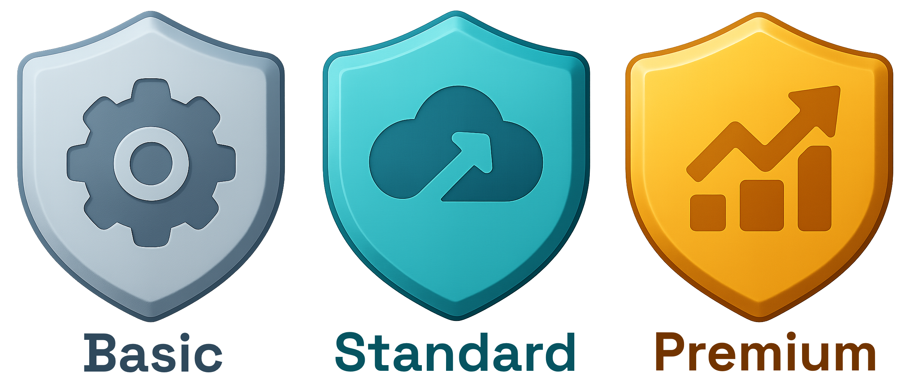

[](README.md)
[](README.md)
[](https://github.com/SaaStacked/saastack/actions/workflows/build.yml)

[](https://www.saastacked.com) [](https://www.saastacked.com) [](https://www.saastacked.com)


# SaaStack

Are you about to build a new SaaS product from scratch on .NET?

Then do yourself a huge favor, and don't start it from scratch. Start with SaaStack instead.

It’s not just a codebase template — it’s your startup's unfair advantage.

SaaStack saves you months (possibly even years) of engineering work (and rework) by giving you a fully-featured, scalable foundation for real-world SaaS products, based on all the latest and great dotnet tech.

It solves the unavoidable work of building out: user authentication, API access, authorization schemes, third-party integrations, management APIs, an initial website, and making all this secure and ready for scale, as well as being highly testable and robust.

Your job as a founding engineer (or startup CTO) is not to do all this from scratch yourself, but to make smart tech, team, tooling and timing decisions that make you move fast, get your ideas to market and start iterating on product market fit.

If you start from scratch youself, yes its fun and exciting, but you have months of work ahead of you just to get something reasonable working for your customers, and that's time and money you dont have to waste. Why not learn from those who have done this ten's of times before in multiple startups? and who can show you what is important to establish in your first couple years, long before you discover you can't do these things, when the crunch comes. 

Skip the startup trap:

- ❌ Reinventing the wheel, where we already have well-known standard solutions
- ❌ Rushing forward on a fragile foundation, that is under-engineered, untestable, insecure, and with no production observability, or extensibility.
- ❌ Building a tangled monolith, destined for a rewrite next year, when you discover that you and your team cannot move fast, stuck in a big-ball-of-mud.

SaaStack is opinionated, but it is also flexible and extensible and real-world. It is not a sample, it has been used and honed in a dozen real world SaaS products already (by the authors).

Since it is a codebase and not a nuget package (secret sauce), you never get boxed inside it waiting for some other team to improve it for you.
- ✅ It’s already battle-tested in several live SaaS companies - you benefit from their in-the-wild learnings and optimizations.
- ✅ It’s cloud-ready (Azure or AWS). It is easily extensible to work with your specific 3rd party providers, plug and play.
- ✅ It does NOT lock you into someone else's framework, and you won't have to plea with them to improve it for you, nor will you send a PR to update it for you. You own it from the start, and can modify it safely at any time.
- ✅ With extensive documentation and regression tests to guide you as you evolve or extend it, you are safeguarded against breaking anything, anywhere.
- ✅ This isn’t a NuGet package. It’s not a toy demo, it's not a code sample. It’s a fully deployable product for serious builders who want to have a robust, testable, secure and fully scalable system from day one.

To be useful now and into the future, and to guard against the future problems of scaling your business, the codebase employs and demonstrates several common architectural styles that you are going to need in your product, such as:

* [A Pluggable Modular-Monolith](https://www.thoughtworks.com/insights/blog/microservices/modular-monolith-better-way-build-software) - always build a monolith first, then separate out to microservices later when, and if, you need to,and your team can support that
* [Clean Architecture, Onion Architecture, and Hexagonal Architecture](https://medium.com/@edamtoft/onion-vs-clean-vs-hexagonal-architecture-9ad94a27da91) all have the same principles - low-coupling, high-cohesion, a shareable and protected domain at its center, exposed by any protocol to any infrastructure. e.g. Hosted behind a distributed REST API, or in a CLI, (or in another executable) your choice.
* [Domain Driven Design](https://martinfowler.com/bliki/DomainDrivenDesign.html) (with Aggregates and Domain Events) - modeling actual real-world behaviors, not modeling just anemic data, publishing events to a distributed system.
* [Event Sourcing](https://martinfowler.com/eaaDev/EventSourcing.html) - because you cannot predict upfront when you will need historical data later, and when you do, you will be stuck. Domain events are already built in your aggregates, ES simply persists them as the master record, from which you can build optimized views to read data.
* [Event-Driven Architecture](https://learn.microsoft.com/en-us/azure/architecture/guide/architecture-styles/event-driven) - to keep your modules de-coupled, distributed, and asynchronous from each other, focused on meaningful events and sagas across your whole product or products.
* [Polyglot Persistence](https://martinfowler.com/bliki/PolyglotPersistence.html) - decouples you from technology choices, makes your entire system easy to test, and when your business scales up later. No need to install any databases or other server products locally, nor any docker containers, for debugging and running locally. Just clone, compile and run, all offline without a network.
* Extensive Test Automation (e.g., Unit, Integration, and E2E) layers so you can confidently keep moving years into the future
* B2B or B2C Multitenancy, you choose
* Extensibility for all integrations with any 3rd party providers (e.g., Stripe, Twilio, Auth0, LaunchDarkly, etc.) - because you want to start cheaply, and change your providers over time as your new business changes and grows, and you can afford better tools.

> The fundamental design principles behind this particular combination of architectural styles is to "maximize change" since it is change that you need to make efficient to succeed in SaaS startups, as you grow. You won't need the best at the start, that will come later. But you need to adapt, and adapt fast. It is the cost of change in software that determines the cost of designing and building software in the long run. Minimizing that cost, and keeping it low, is key for any new product tech business's survival, especially when investment is scarce.

This codebase template gives you most of the things all SaaS products will need from day one while maximizing your ability to evolve the specific behaviors and infrastructure components of your specific product - for the long run (i.e., over the course of the next 1-5 years).

## What is in the box?

### Demo Site

We have a demo SaaS product called "[LoopCar](https://loopcar-websitehost.azurewebsites.net/)" for you to try out! (If you are interest, you can see the backend API [here](https://loopcar-apihost1.azurewebsites.net) too).

> This is hosted in Azure

### Azure Deployment

This is what you get if you prefer to host it in Azure:


### AWS Deployment

This is what you get, if you prefer host it in AWS:


## How is the code structured?

Modularly, in both Horizonal layers and Vertical slices, and in over 100+ projects!!

Yes, 100 projects! Why? because the world has moved on, and you are building a long-lived highly maintainable product now that needs to scale with your business and with your growing team.

> Bad smells: If you are used to cramming in all your code into one or three assemblies for your entire API, then you are not managing dependencies very well at all, and that codebase simply isn't going to scale. Too much software, too tangled and in too few deployable units. You won't be able to scale it, maintain it for the business nor for your team.

In larger codebases, you need to structure things much better to manage complexity in the long run. Everything is against you in a rapidly growing business like a startup.

> Even your favorite code IDE makes it far too easy to violate de-coupling rules, just by adding a `using` statement to some type, somewhere else in the codebase you are possibly inadvertently adding dangerous coupling.

Then, later down the track, when scaling-out your business and your team becomes a real-life issue, you won't be able to factor out code from a tight set of jumbled assemblies, into anything cohesive as another deployable unit. You simply can't do it.

> Let alone not being able to split up your SQL database of tangled JOINS and reused and cramped tables. 

These are the reasons why we not only have very structured boundaries form the get go, but we have automated tests and highly testable isolated components and modules, along with Roslyn analyzers, architecture tests, and other developer tooling to prevent you from applying these bad practices inadvertently as the pressure increases, when you are highly susceptible to create *accidental complexity* for the sake of expediency.

SaaStack is far more than just a codebase. Not only are you getting a comprehensive production-ready, and battle tested codebase, ready to go, but you are also getting a set of tools and practices included to help you and your team to grow and keep it sustainable in the long run.

### Handling the structure

The best experience for working with this template is in an IDE like JetBrains Rider, or Visual Studio, or Visual Studio Code (with solution file), because these tools can supporting all the developer tooling we have included.

None of these IDEs nowadays (since 2022 for Visual Studio) have issues anymore with loading 100+ projects! It is simply not a design constraint anymore. Coupling dependencies is the main issue you need to focus on managing more carefully today. A .NET project (and by extension the assembly it produces) are simply just a bounded container of code, it is not the runtime process, and nor is it deployable unit anymore.

> Tip: If working in an IDE is not your team's thing, then you can also rearrange the project folders into whatever structure you like. SaaStack is a template after all! Nothing says you can't change the folder structure to what suits your context. Nothing says you can't combine the code in the projects. Go for it, have it your way! We simply recommend the structure we have given you as a starting point. This is just our best opinion about what works best for the teams that have worked with it for long periods of time.


## Who is this for?

This starter codebase is NOT for everyone, nor for EVERY software project, nor for EVERY skill level.

> We need to say that because all software products are different, there is not one silver bullet for all of them.

* The people using this template must have some experience applying "first principles" of building new software products from scratch because it is a starter template that can (and should) be modified to suit your context. (It is a far better starting point than building everything from scratch again. You need to understand the principles, not have to rewrite them all over again!).

* The tech stack is a .NET core backend (LTS version 8.0 or later) written in C#, using (a few) but very popular and well-supported 3rd party libraries. (We've worked very hard to find a balance between too few and far too many).
* This starter template deliberately makes engineering trade-offs that are optimized for situations where:
  1. High maintainability is super important to you over long periods of time (e.g., long-lived codebases)
  2. Managing complexity over long periods of time is non-negotiable (~1-10 years), and avoiding big balls of mud (BBOMs) is paramount to you,
  3. Where many hands will touch the codebase (i.e., over the course of its entire life). Of course, if you are working alone on a project, you will have personal preferences, free from the practical constraints of working in teams.

## What business is it for?

The kinds of '*known scenarios*' that this template is designed specifically for:

* Tech SaaS startups building their product from scratch
* or experienced developers who are very familiar with these patterns and concepts and wish to adapt them to their context

Can you use this template if your context is different?

* Yes, you can, but you need to be aware of why the trade-offs have been made in the way they have been made, then adapt them to your needs

Are these trade-offs suitable for any kind of software project?

* No, they are not.
  * However, some of them may fit your specific context well.

> Want to know what the initial design constraints, assumptions, and trade-offs are, then see our [Decisions Log](docs/decisions/README.md) and [Design Principles](docs/design-principles/README.md) for more details on that.

## How do you use it?

It is a starter "template," not a 3rd party library or a fancy 3rd party framework.

Once you clone the codebase, it is all yours!

* You copy this codebase, as is, as your new codebase for your product, push it to a new git repo, as is.
* You rename a few things to make this your SaaS product.
* You compile it, you run its tests, and you deploy its pieces into your cloud environment (e.g., Azure, AWS).
* You then continue to evolve and add your own features to it (by following the established code patterns).
* You then evolve and adapt the code to wherever you need it to go.
  * Don't like those patterns? Then change them to suit your preferences. There are no rigid frameworks or other dev teams to bargain with.
* At some point, you will delete the example subdomain modules (Cars and Bookings) that are provided as examples to follow and, of course, replace them with your own subdomain modules.
* Read the [documentation](docs/README.md) to figure out what it already has and how things work.
  * So that you either don't need to worry about those specific things yet (and can focus on more valuable things), or you can modify them to suit your specific needs. It is your code, so you do as you please to it.

Since this starter "template" is NOT a framework (of the type you usually depend on from others downloaded from [nuget.org](https://nuget.org)), you are free from being trapped inside other people's abstractions and regimes and then waiting on them to accommodate your specific needs.

> With this template, all you need to do: is (1) understand the code here, (2) change the code to fit your needs, (3) update the tests that cover those changes, and (4) move on. Just like you do with any and all the code you write when you join a new company, team or project. It is no different to that.

## Want it to scale?

What happens when the performance of this modular monolith requires that you MUST scale it out and break it into independently deployable pieces?

> Remember: No business can afford the expense of waiting for you to re-write your product at some future date - so forget that idea!

This codebase has been explicitly designed so that you can split it up and deploy its various modules into separate deployable units as you see fit (when your product is ready for that, or when your team grows large enough to warrant that).

Unlike a traditional monolithic codebase (i.e., a single deployable unit), all modules in this Modular Monolith codebase have been designed (and enforced) to be de-coupled and deployed independently in the future.

You just have to decide which modules belong in which deployed components, wire things up correctly (in the DI), and you can deploy them separately.

> No more re-builds and extensive re-engineering to build a new distributed codebase when the time comes. It is all already in there for that future date.

## What does this codebase contain?

It is a fully functioning and tested system with some common "base" functionality.

It demonstrates a working example of a *made-up* SaaS car-sharing platform just for demonstration purposes.

See it running for real, [here](https://loopcar-websitehost.azurewebsites.net/).

> You would, of course, NOT be building a car sharing business, and you of course, will be replacing that stuff with your own code! It is only there to demonstrate real code examples you can learn from.

The starter template also takes care of these specific kinds of things:

* Deployment
  * It can be deployed in Azure (e.g., App Services or Functions) or in AWS (e.g., EC2 instances or Lambdas)
  * It is designed to be split into as many deployable pieces as you want when needed. (You simply replace the "RPC adapters" with "HttpClient adapters").
* REST API:
  * It defines a ruleset about how JSON is represented on the wire and how requests are deserialized (to cope with different client styles)
  * It localizes developer errors
  * It handles and maps common exceptions to standard HTTP status codes
  * It returns standard HTTP statuses for successful requests based on the HTTP method (e.g., `GET`= 200, `POST` = 201, `PUT` = 202, `DELETE` = 204)
  * Provides a Swagger UI.
* Infrastructure & Extensibility:
  * All infrastructure components are independently testable adapters
  * It implements multi-tenancy for inbound HTTP requests (e.g., HTTP Host headers, URL keys, etc.)
  * It implements multi-tenancy (for data segregation) using either data partitioning, physical partitioning, or both.
  * It implements polyglot persistence, so you can use whatever persistence technology is appropriate for each module per data load (e.g., Microsoft SQLServer, Postgres, Redis, DynamoDB, Amazon RDS, Local File, In-Memory, etc.)
  * It integrated 3rd party identity providers for authentication, 2FA, SSO, and credential management (e.g., Auth0, Microsoft Graph, Google, Amazon Cognito, etc.).
  * It integrates billing subscription management providers so that you can charge for your product use and determine feature sets based on subscription levels (e.g., Stripe, Chargebee, Maxio, etc.).
  * It integrates feature flagging providers to control how to access your features and roll them out safely (e.g., Launch Darkly, GitLab, Unleashed, etc.)
  * It integrates product usage metrics to monitor and measure the actual usage of your product (e.g., MixPanel, Google Analytics, Application Insights, Amazon XRay, etc.)
  * It integrates crash analytics and structured logging so you can plug in your own preferred monitoring (e.g., Application Insights, CloudWatch, Sentry.io, etc.).
  * It uses dependency injection extensively so that all modules and components remain testable and configurable.
  * It defines standard and unified configuration patterns (e.g., using `appsettings.json`) to load tenanted or non-tenanted runtime settings.
* Developer Experience:
  * It provides documented code examples for the most common use cases. Simply follow and learn from the existing patterns in the codebase
  * It provides [how-to guides](docs/how-to-guides/README.md) for performing the most common things on a codebase like this until you've learned the patterns.
  * It provides a [decision log](docs/decisions/README.md) so you can see why certain design decisions were made.
  * It provides documentation about the [design principles](docs/design-principles/README.md) behind the codebase so you can learn about them and why they exist.
  * It \[will\] provide an ecosystem/marketplace of common adapters that other people can build and share with the community.
  * It demonstrates extensive and overlapping testing suites (unit tests, integration tests, and end-to-end tests) to ensure that production support issues are minimized and regressions are caught early on. As well as allowing you to change any of the existing base code safely
  * It defines and enforces coding standards and formatting rules
  * It utilizes common patterns and abstractions around popular libraries (that are the most up-to-date in the .NET world), so you can switch them out for your preferences.
  * It defines horizontal layers and vertical slices to make changing code in any component easier and more reliable.
  * It enforces dependency direction rules so that layers and subdomains are not inadvertently coupled together (enforcing architectural constraints)
  * It gives you a functional README.md file so new hires to your team will be onboarded in less than an hour!

## Try it out yourself!

1. Download and explore the codebase and documentation

    ```
    git clone https://github.com/SaaStacked/saastack.git
    cd saastack
    ```

2. Build the back end, and build the front end.

    ```
    dotnet build "src/SaaStack.sln"
    cd src/Hosts/WebsiteHost/ClientApp
    
    npm install
    npm run build
    ```

3. Run some of the back end tests

    ```
    cd ../../../../
    dotnet test --no-build --filter:"Category=Unit" "src/SaaStack.sln"
    ```

4. Launch the API, the Web App, and stubs - nothing to install locally!

    ```
    dotnet run --no-build --launch-profile "ApiHost1-local" --project "src/Hosts/ApiHost1/ApiHost1.csproj"
    dotnet run --no-build --launch-profile "WebsiteHost-local" --project "src/Hosts/WebsiteHost/WebsiteHost.csproj"
    dotnet run --no-build --launch-profile "TestingStubApiHost-local" --project "src/Hosts/TestingStubApiHost/TestingStubApiHost.csproj"
    
    start https://localhost:5001
    start https://localhost:5101
    ```

## Is this all you get?

From this open source project, you get ALL of this for _Free_:
* You can clone, build, test, run, debug, and develop all this locally!
  * No local dependencies on any infrastructure, no databases, no docker containers, nothing!
  * Develop on Windows, On MacOS, On Linux.
* The codebase is team ready, so you can onboard new team members and get them up to speed quickly.
* You can start designing and building your product right now, complete with a CI pipeline in GitHub.
  * Build out your product
  * Demo it to your company from your local machine.

But what you can't yet do, is deploy this into a commercial production environment:

For that you need a few more things:
* You need a set of cloud provider connectors to connect to: databases, queues, message buses, and APM for monitoring
  * So you can run this product in either Azure or AWS.
* You need a set of production environment technology adapters, to interact (both ways) to various 3rd party services
  * For example, to connect to: SSO Providers, Twilio, Mailgun, Stripe, UserPilot, Launch Darkly, etc.
* You need an automated deployment pipeline to push releases to a cloud production environment, in minutes.
* And you could use some more helpful documentation to learn the patterns and techniques
  * Coding standards for your team
  * Tools to keep consistency
  * Rules and conventions to train your favorite AI tool to help you knock out your future product at rapid speed!


That is what [SaaStack Standard](https://www.saastacked.com) and [SaaStack Premium](https://www.saastacked.com) are all about.

<a href="https://www.saastacked.com"></a>

Upgrade, for a one time fee, and get access to everything to launch your new product in the cloud. 

Then get access to community of other SaaS builders who are extending the core architecture for more mature SaaS products and services.