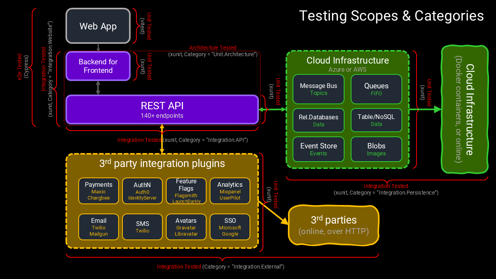

# Testing Strategies

Here we talk about how we apply testing in its many forms to this codebase, and overall system design.

Overall strategy is to:

* Build confidence enough to change any of the code, without suffering any regressions.
* Build confidence enough to change any of the code, and release frequently and safely to customers.
* Execute all tests from local desktop environments, as well as in CI.
* Gatekeep releasing regressions into production.
* Not require any external infrastructure or remote services to be available, for most everyday code changes.
* Testing in depth.
* Use the appropriate testing frameworks, harnesses and tools, that can be securely eliminated from production code with zero runtime overhead (no 'back doors').



## Applying high levels of test automation

In order to achieve high levels of test automation, we have to have built in mechanisms and extensibility (built into the software itself) that would otherwise not be present in the software. (and not found in untested software).

It turns out that in moving to high test automation, many defensive programming techniques or strict code design principles (e.g. strict OO encapsulation, TellDontAsk, the Law of Demeter, etc.) still need to be considered but also traded-off to some small degree.

Also, when designing testable software we need to consider innovative ways to make the software more testable but not compromise one set of principles for the other. Both sets of principles can co-exist to a very large extent.

> A side note: Test coverage in of itself, as a metric/target to improve or maintain, is not useful, and is often harmful to teams and organizations when applied naively for the intention of improving productivity - this intent should be avoided at all costs. However, code coverage as a measure to learn from, in regular daily practice, can be very useful in order to tell us whether we are likely to have confidence in changing the code.

## TestingOnly code

In this codebase, we make extensive use of C# compilation directives and build configurations in order to give support for testing various artifacts for when we are developing changes. At the same time, this same mechanism, provides a convenient way to completely eliminate all testing artifacts from ever reaching production code. Effectively eliminating the testing "back doors".

> Security note: testing back doors are often forgotten by teams, and can be left in production code that provide inadvertent and unintended security vulnerabilities in code.

There are two parts, in this codebase, that work together to provide an elegant, sustainable and maintainable solution:

1. Use of the `#if TESTINGONLY....#endif` compilation directive
2. The build configurations: `Debug`, `Release` and `ReleaseForDeploy`

No matter what the specific testing tactics may be, we can mark up C# code and blocks of code, with the directives `#if TESTINGONLY`. This gives us great flexibility to define testing extensions, testing data values, and additional code paths in normal code to support testing, and make the code far more testable. In some extreme cases, expose data that would otherwise not be exposed with high quality design principles, that would only present when testing the code. 

### The interplay

This `TESTINGONLY` C# directive is present in only the `Debug` and `Release` build configurations, and is not defined in `ReleaseForDeploy`.

* When we are working in the code on local machines, we are usually ALMOST ALWAYS working in `Debug` configuration.
* We would switch to `ReleaseForDeploy` only for the purposes of adding code that is to ONLY be used in production builds, and ensuring the code builds properly. Which does not change that often.
  * For example, including certain technology adapters in dependency injection code.
* We should NEVER *execute* any code in the `ReleaseForDeploy` build configuration on a local machine, (nor in CI environments), as this specific build configuration would require certain included technology adapters (like: database adapters)  to execute that would require certain (i.e. from `appsettings.json`) settings to work at all, against real infrastructure (likely over TCP or HTTPS).
  * Furthermore, these specific required settings (i.e. from `appsettings.json`) would need to point to real infrastructure (in the cloud, over the internet, or accessible to the local machine in docker containers) for the code to run at all!
    * Those settings to that infrastructure, should never be production infrastructure - EVER!
    * In one case, specifically when testing technology adapters, these settings can be pointing to dedicated "TestingOnly" sandboxes (i.e. setup specifically with 3rd party vendors, specifically for testing, but separate from production assets).
    * But, otherwise, such settings, to real remote, production systems should never be on a team members local machine in the first place!
  * Lastly, destructive functions like deleting persisted data (that might be supported by some technology adapters), WILL ALWAYS be marked up as `#if TESTINGONLY` as a last line of defense against running code with production settings, in any scenario. Intentional or accidental.

> Build configurations: `Release` and `ReleaseForDeploy` are only ever used in CI and CD pipelines.


We can use compilation directives in C#, but we cannot use them in JavaScript in the frontend JavaScript Application.

To propagate this technique to the JavaScript application, we use this mechanism:

1. The BEFFE (`WebsiteHost` project) ALWAYS renders the `Index.html` page server-side. This page is never static, or produced in the browser.
2. In `Debug` builds a global variable called `isTestingOnly` is set to true or false on the `window` object.
3. Code in the JS App can check this variable at runtime, and can act on it.
4. In extreme cases, where there exists code or assets that we never want to be bundled into production assets we can extend the Vite bundler to exclude them based on the `mode` in Vite. (i.e. `mode == production`).

## Testing Data

In many tests, no matter the category or technology, we have to specify test data.

2 considerations:

### Testing Values

1. Values used in testing need to be made to look like test data.
   1. as opposed to trying to make test data look *real*.
   2. This is an important practice because, the intent behind tests is to verify the codes' behavior, and real data or real-looking data is beside the point, and a distraction. Most code should work no matter what the data is.
      1. Except for code that acts on specific data values. In such a case, that behavior should be clear from the naming of the tests themselves, and that data should be defined somewhere central and referred to in tests as well as code under test.
   3. In some cases, real-looking data can be mistaken as data that affects the codes behavior. Such things we call "magic strings" or "magic values", where the value changes the code's behavior. Again, see previous point.


For example, examine the data values being used in this unit test (in `OrganizationsApplicationSpec.cs`):

```c#
    [Fact]
    public async Task WhenChangeSettingsAsync_ThenReturnsSettings()
    {
        var org = OrganizationRoot.Create(_recorder.Object, _idFactory.Object, _tenantSettingService.Object,
            OrganizationOwnership.Shared, "auserid".ToId(), UserClassification.Person,
            DisplayName.Create("aname").Value, DatacenterLocations.Local).Value;
        org.CreateSettings(Settings.Create(new Dictionary<string, Setting>
        {
            { "aname1", Setting.Create("anoldvalue", true).Value },
            { "aname4", Setting.Create("anoldvalue", true).Value }
        }).Value);
        _repository.Setup(rep => rep.LoadAsync(It.IsAny<Identifier>(), It.IsAny<CancellationToken>()))
            .ReturnsAsync(org);

        var result = await _application.ChangeSettingsAsync(_caller.Object, "anorganizationid",
            new TenantSettings(new Dictionary<string, object>
            {
                { "aname1", "anewvalue" },
                { "aname2", 99 },
                { "aname3", true }
            }), CancellationToken.None);

        result.Should().BeSuccess();
        _repository.Verify(rep => rep.SaveAsync(It.Is<OrganizationRoot>(o =>
            o.Name == "aname"
            && o.Ownership == OrganizationOwnership.Shared
            && o.CreatedById == "auserid"
            && o.Settings.Properties.Count == 4
            && o.Settings.Properties["aname1"].Value.As<string>() == "anewvalue"
            && o.Settings.Properties["aname2"].Value.As<double>().Equals(99D)
            && o.Settings.Properties["aname3"].Value.As<bool>() == true
            && o.Settings.Properties["aname4"].Value.As<string>() == "anoldvalue"
        ), It.IsAny<CancellationToken>()));
        _tenantSettingsService.Verify(tss =>
                tss.CreateForTenantAsync(It.IsAny<ICallerContext>(), It.IsAny<string>(), It.IsAny<CancellationToken>()),
            Times.Never);
    }
```

> Note: all data used as inputs in the "arrange" and "act" parts of a test are intended to say these values are intentionally test data values.

### Source of data

Second consideration is how to get data into the code under test.

* For unit tests, these values are often sourced in the test method itself, using the techniques above.

* For larger scoped tests, like integration tests, the volume of test data is far larger, and that data requires better coordination between the setup and assertion parts of the test.
  * In these larger scope tests, we strongly recommend (and demonstrate) loading tests via public interfaces, such as APIs
  * We strongly recommend against injecting test data into persistence stores directly - which is unfortunately another all too common practice at large in the industry.
    * Not only does writing data to specific persistence stores require detailed knowledge of the technology of those stores, and additional tooling to perform these steps, but it also requires detailed knowledge of the relationships of the data within those stores.
      * Neither set of knowledge or overhead is relevant to testing the code, nor testing behavior of the system.
      * These practices make the code more brittle to change, and thus, less maintainable.
      * Knowledge only of the public interfaces is all that is required to set up and assert the internal behaviors of the system.
  * We strongly recommend adding extra testing only endpoints to public interfaces to either capture or expose data for testing that would otherwise not be exposed in the system design. These testing extension points can be easily compiled out of the production code.


For example, examine the use of this API endpoint for integration testing person registration flows:

The endpoint (defined in `CredentialsApi.cs`) :

```c#
#if TESTINGONLY
    public async Task<ApiGetResult<PersonCredentialEmailConfirmation,
            GetPersonCredentialRegistrationConfirmationResponse>>
        GetConfirmationToken(
            GetPersonCredentialRegistrationConfirmationRequest request, CancellationToken cancellationToken)
    {
        var token = await _personCredentialsApplication.GetPersonRegistrationConfirmationAsync(
            _callerFactory.Create(), request.UserId!, cancellationToken);

        return () =>
            token.HandleApplicationResult<PersonCredentialEmailConfirmation,
                GetPersonCredentialRegistrationConfirmationResponse>(
                con =>
                    new GetPersonCredentialRegistrationConfirmationResponse { Token = con.Token });
    }
#endif
```

Using the testing only endpoint to test the registration flow completes correctly (in `CredentialsApiSpec.cs`):

```c#
     public async Task WhenConfirmRegistrationAndAuthenticates_ThenAuthenticates()
    {
        var person = await Api.PostAsync(new RegisterPersonCredentialRequest
        {
            EmailAddress = "auser@company.com",
            FirstName = "afirstname",
            LastName = "alastname",
            Password = "1Password!",
            TermsAndConditionsAccepted = true
        });

        await PropagateDomainEventsAsync();
#if TESTINGONLY
        var token = (await Api.GetAsync(new GetPersonCredentialRegistrationConfirmationRequest
        {
            UserId = person.Content.Value.Person.User.Id
        })).Content.Value.Token;

#endif
        await Api.PostAsync(new ConfirmPersonCredentialRegistrationRequest
        {
            Token = token
        });

        await PropagateDomainEventsAsync();
        var result = await Api.PostAsync(new AuthenticateCredentialRequest
        {
            Username = "auser@company.com",
            Password = "1Password!"
        });

        result.Content.Value.Tokens.AccessToken.Value.Should().NotBeNull();
        result.Content.Value.Tokens.AccessToken.ExpiresOn.Should()
            .BeNear(DateTime.UtcNow.Add(AuthenticationConstants.Tokens.DefaultAccessTokenExpiry));
        result.Content.Value.Tokens.RefreshToken.Value.Should().NotBeNull();
        result.Content.Value.Tokens.RefreshToken.ExpiresOn.Should()
            .BeNear(DateTime.UtcNow.Add(AuthenticationConstants.Tokens.DefaultRefreshTokenExpiry));
    }
```

> Note: the data returned by this endpoint (i.e. the `token`) would NEVER be exposed by any production endpoint, EVER!

## Test types and categories

The kinds of tests, and principles behind testing in this codebase is accurately described using the [Testing Pyramid](https://martinfowler.com/articles/practical-test-pyramid.html)


>  Note: Where, we should see an order of magnitude increase in the number of tests, and decrease in the speed and effort of making/maintaining the tests, as we move down the layers in the pyramid.

We use many different testing technologies and harnesses, appropriate to the specific kind of tests we need, from Xunit in C# backend code, to Vite unit tests in frontend JavaScript, to Cypress tests when testing browser UI around the whole system.

We define only 3 major categories of functional automated tests:

1.  **Unit tests** - testing an isolated piece of code (i.e. one class, or a small ensemble of classes). Single component, no infrastructure, no IO of any kind.
2. **Integration tests** - testing a public accessible interface (e.g. a REST API, a FIFO queue, a Message Bus, etc.) or testing a pluggable technology adapter or very well-defined "internal" interface. Testing the integration of many components in different layers or slices. May include real or fake infrastructure and IO.
3. **End-to-End tests** - testing large piece of the overall system together. Testing the overall experience of the system, usually involving many touch points  (e.g. UI, plus Email, plus Push Notifications). May include real or fake infrastructure and IO.

> Note: there are many other kinds of tests that we are not mentioning here. For example, load testing, performance testing, smoke testing, UAT testing and penetration testing. These are all important kinds of testing, and we are not excluding them.
>
> Note: there are also many names and aliases in use in the industry for the different kinds of functional testing we have mentioned above. For example, contract testing, system testing, component testing, etc., etc., etc. We aim to keep things a little bit simpler here and to 3 categories.

In the presence of all these tests, the same piece of code may be covered several times, either by a single category, or by all categories. It is this verification in depth that builds high levels of confidence in changing and releasing the code to production and customers. 

Let dive a little further into these categories of tests and explore some variants.

### Unit testing

In practice, unit testing is about making sure individual classes/components of the software work in isolation to a strict and well-defined interface. Inputs and Outputs, as defined by the component.

For example, in C# a unit might be concrete classes that implement a `public interface` or it might be a pure extension method with a well-defined signature.

For example, in JavaScript UI Components, a unit might be a concrete class or function will a well-defined interface or signature.

In all cases, the "units" of code are defined by their methods, and the dependencies they consume.

In unit testing, we can also define a "unit" as a small ensemble of classes that work closely together. The size of that ensemble is determined by the dependencies any class has. The tester has the option of including some concrete dependencies in the ensemble, or mocking those dependencies in the tests. There is variance in how much mocking is applied, and it is often a tradeoff of brittleness.

**Key characteristics:**

* **Mocking dependencies** - The use of mocking frameworks is very common in unit testing. 

* **Setup data** - data is often small and hardcoded.

* **Parallelism** - Unit tests SHOULD be always be highly-isolated and also run in memory, and thus running all unit tests in parallel is highly recommended.

* **Quantity** - The number of unit tests SHOULD be deterministically finite, and strongly correlated with the number of branches of code in the code under test.

* **Categories** - Unit tests in c# code should define a category or subcategory of `Unit`.
  * Some notable categories are: `Unit`, `Unit.Architecture` and `Unit.Tooling`.

### Integration testing

Integration testing focuses on verifying that multiple components work correctly together through their public interfaces. These tests validate the integration between different layers, services, and external dependencies.

**Key characteristics:**

* **Setup data** - Integration tests require more complex data setup than unit tests (many more relationships in the test data). We load test data through public APIs rather than directly manipulating persistence stores. This approach maintains independence from specific storage implementations and ensures tests remain maintainable as the system evolves.

* **Parallelism** - Integration tests should be designed to run in isolation at all times, but may have many constraints due to shared resources (accessing the same infrastructure and persisted state. Thus running them in parallel without some form of segregated data scope is very difficult. For many integration tests, we use the same infrastructure, but we segregate data stores between different assemblies.  Within the same assembly, we CANNOT run the integration tests in parallel. But it is feasible to run integration tests in different assemblies in parallel.

* **Scope** - Integration tests may include real or fake infrastructure and IO operations. The number of integration tests can be theoretically infinite, as they test combinations of components and various data scenarios.

* **Quantity** - The number of integration tests required to cover code sufficiently is indeterminable, due to the number of possible code paths being included in the components being tested, and the permutations of input data being used. Thus, sufficient levels of confidence are only obtained by creating a sufficient number of tests that cover the well-defined scenarios, or troublesome scenarios that SHOULD to be covered. 

* **Categories**:
  * `Integration.API` - verify REST API endpoints work correctly with the full application stack
  
  * `Integration.Website` - verify the unique BEFFE (Backend For Frontend) functionality
  * `Integration.External` - verify that 3rd party and cloud technology adapters work against their respective 3rd party systems 
  * `IntegrationPersistence` - a subclassification of `Internal.External` tests just for persistence technology adapters, that verify these adapters work against their respective 3rd party systems.

**Testing-only endpoints:**

We extensively use `#if TESTINGONLY` to create API endpoints that expose data or functionality needed for testing that wouldn't normally be available in production APIs. These endpoints are completely eliminated from production builds.

#### Stubs

Since integration tests almost always include infrastructural components of some kind (i.e. any component involving I.O., such as data stores, configuration, files, networking etc.) in the system, we need to make use of Stubs (as test-doubles) for a few reasons:

1. We don't want to require internet access, or real systems, during integration test runs.
2. We don't care for the technical details of these infrastructural components and want to more easily control how they work.
3. We want to control how some of these systems work and be able to interrogate that they were used, and how they were used in certain tests.
   * For example, we may want to know that an email was sent to the new user as a result of registering that new user.
   * For example, we want to set up data via other API endpoints, and see the set-up data returned in an API call.  

Integration tests make extensive use of stub implementations to replace external dependencies, some used in all integration tests, some used in specific use-case testing scenarios:

* `StubRecorder` - Replaces logging/telemetry services for verification of audits, logging and crash reporting.
* `StubEventNotificationMessageBroker` - replaces message bus for event testing.
* `StubUserNotificationsService` - replaces the email/SMS sending clients.
* `StubFakeBillingProvider` - replaces the billing provider for subscription testing.

### End-to-End testing

E2e testing is similar to integration testing, but usually performed at the furthest "touch point" of the software, or outer most interface of the software. For software that includes user interfaces (UIs), e2e tests involve testing UI in web applications or mobile applications.

They require most of the other components of the system to be running in some form.

For example, in this codebase, the Web UI tests require that the BEFFE and API are running, and all their supporting infrastructure and 3rd party integrations are running in some form - usually as Stubs.

**Key characteristics:**

* **Setup data** - E2e tests require more complex data setup than unit tests, just like integration tests.

* **Parallelism** - Same as integration tests above.

* **Scope** - Same as integration tests above.

* **Quantity** - The number of e2etests required to cover code sufficiently is indeterminable, due to the number of possible code paths being included in the components being tested, and the permutations of input data being used. Thus, sufficient levels of confidence are only obtained by creating a sufficient number of tests that cover the well-defined scenarios, or troublesome scenarios that SHOULD to be covered. 