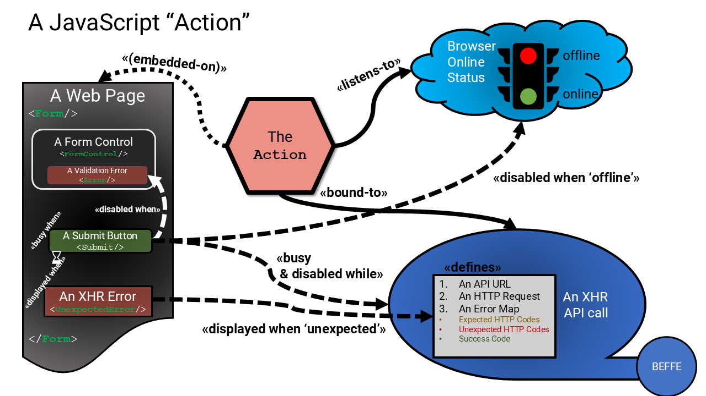

# JavaScript Actions

## Overview

JavaScript "Actions" are the heart of a UI mechanism (in web-based clients) that provides completeness, consistency and durability when building user interfaces. In a way, they are an architectural style designed to solve many problems we see experienced by developers building UIs rapidly.

When "actions" are used, the overall usability of a product increases, and the overall effort by the engineer decreases. Using actions helps engineers create new user interfaces quickly and reliably, and allows them to focus on what is important, while actions take care of the mundane and uninteresting duties that are expected as table stakes for any reasonable operating UI.

Building an interactive user interface is a complex activity, usually focused on getting something working, as per some visual or imagined design. Even the simplest of interactions with the user, like handling a user login, requires coding for many use cases (e.g., happy path, error paths), and several edge cases that are difficult to remember (e.g., validation, network issues), and handle completely and effectively.

In the pursuit of building any interactive 'view', and during the many iterations of the implementation of that view, it is very easy for an engineer to forget to handle very basic usability issues like handling errors, dealing with network connectivity, and helping the user "fall into the pit of success" with their new interactive view. In normal use, despite their best intentions, many of the error and edge cases of using the view are actually exercised by the user in the real world, before they achieve success with it. It is in these edge cases, that engineers often forget to handle them correctly, assuming they will get to them properly later. Later never comes until a production defect is found by a user.

End users really don't want to be using systems that fail often, and in the internet-dominated world of unreliable connectivity, this is quite tricky to achieve well without armies of engineers and testers at hand, and continuous regression testing.

What can really help is a general-purpose mechanism that helps engineers focus on solving the happy path, which is backed up by built-in mechanisms that handle the more unusual unhappy paths.

That is exactly why we have designed "Reactive Actions".

(Read: this [Design Decision](../decisions/0170-javascript-actions.md) for more examples on why this mechanism is required)

## Implementation

Here is a JavaScript Action.

The action is used in all interactive UI pages/components that make calls to backend APIs.

The action is a simple 'class' derived from a base implementation, either wired into a JavaScript framework, or into custom JavaScript components.

The action is bound to:

1. An `IOfflineService`, that monitors the 'online' status of the browser/device
2. An XHR API call (e.g., an Fetch/Axios generated client)
3. A defined set of end-user expected errors (i.e. HTTP status codes) with end-user specific messages.
4. Optionally, bound to a UI form, that is pre-populated with a set of Action aware components. These components respond to the state of the action.

### How It Works

Regardless of the JavaScript architecture or JavaScript framework itself (e.g., Vue.js, React.js, JQuery, etc.) or whether it is hand-rolled, there are some default behaviors that Actions must perform.

> Implementation details vary, but all these behaviors can be implemented with any of these frameworks or manual approaches.

In this codebase, please refer to both `useActionQuery` and `useActionCommand` classes in the `WebsiteHost/Client/src/actions` folder, and the `Form` component in the `WebsiteHost/ClientApp/src/components/form` folder.

#### Offline Handling

The `IOfflineService` actively monitors the browser's network connectivity.

* This service both passively and actively detects when network connectivity is lost using various strategies (i.e., `window.navigator.online` and polling an known endpoint, like the `/api/health` endpoint),
* It maintains a state of 'online' or 'offline'.
* This service must also be updated whenever any XHR call fails due to loss of connectivity, and when it is, it must then actively detect when connectivity is restored.

The action is always wired into this `IOfflineService`:

When 'offline':

* The UI will indicate that the user experience is offline (e.g., a banner on top of the page).
* No XHR API call can be made. See "XHR Handling" below for more details.
* If the action is bound to a `<Form/>`, then see "Form Handling" below

When 'online':

* The UI will indicate that the user experience is online (e.g., hide the offline banner on top of the page).
* The bound XHR call will be allowed to be made. See "XHR Handling" below for more details.
* If the action is bound to a `<Form/>`, then see "Form Handling" below

#### XHR Handling

All actions are bound to a mandatory XHR definition, which will define an HTTP request, a URL, and optionally collections of 'expected' and with messages to be shared with end users, should they arise.

* The XHR call can be made programmatically by the action.
* The bound XHR call will be allowed to be made only when the `IOfflineService.status` is 'online'
* When the call is being made, the action will block the XHR call from being made again until the existing call is returned.
* If the action is bound to a `<Form/>,` then:
   * The `<FormSubmitButton/>` control will be wired up to invoke the XHR call.
   * When the XHR returns an 'offline' error, the `IOfflineService` status is updated.
   * See "Form Handling" below for more details

#### Form Handling

The action can be optionally bound to a `<Form/>`; when it is, there are a number of form-based controls that can interact with the Action, to handle "offline" status, XHR status, and any error responses, and handle form validation.

These three integrated mechanisms do much of the heavy lifting for engineers. All they have to do is wire them up correctly.

When the `IOfflineService.status` is "offline":

* The `<FormSubmitButton/>` control will be disabled.
* The `<Form/>` will indicate that the user experience is offline (e.g., display a footer text under the `<FormSubmitButton/>` button)

When the `IOfflineService.status` is "online":

Then the form validation state controls the behavior of the `<FormSubmitButton/>` component, controlled by the validation state of each form component.

* For each form component, if there are any validation errors, component will display a validation message as a label or as a tooltip, and with some visual style.

* The `<FormSubmitButton/>` control will be enabled, depending on the total validation state of all controls on the form.

* When the form is valid, and the user clicks the `<FormSubmitButton/>` button
* The `<FormSubmitButton/>` button will invoke the XHR call, and when it does:
   * The `<FormSubmitButton/>` button will be immediately disabled
   * All controls on the form will be disabled
   * The `<FormSubmitButton/>` button will display a "busy" cue (e.g., a spinner on the button or a spinner on the page)
   * When the XHR is returns 'success', the `<FormSubmitButton/>` button, and all form controls remain disabled, and the "busy" cue is hidden, the label on the `<FormSubmitButton/>` button is updated with a user-defined label indicating success.
   * When the XHR is returns any error, the `<FormSubmitButton/>` button and all form controls are enabled again, and the "busy" cue is hidden.
   * When the XHR returns an 'unexpected' error, the `<UnexpectedError/>` component is updated with a general error (e.g., one that asks the user to opt into reporting the error) and other relevant context to encourage the user to submit a user-defined crash report for the support team. Also, the error must be logged to the `IRecorderService.crash()`.
   * When the XHR returns an 'expected' error, the built-in `<Alert/>` component (on the `<Form/>`) is updated with the user-defined error message.
   * When the XHR returns a 'success' response, the action can perform a user-defined callback, and can perform some action. This can be anything, but could be to display a success message as a toast, or navigate to another view.
