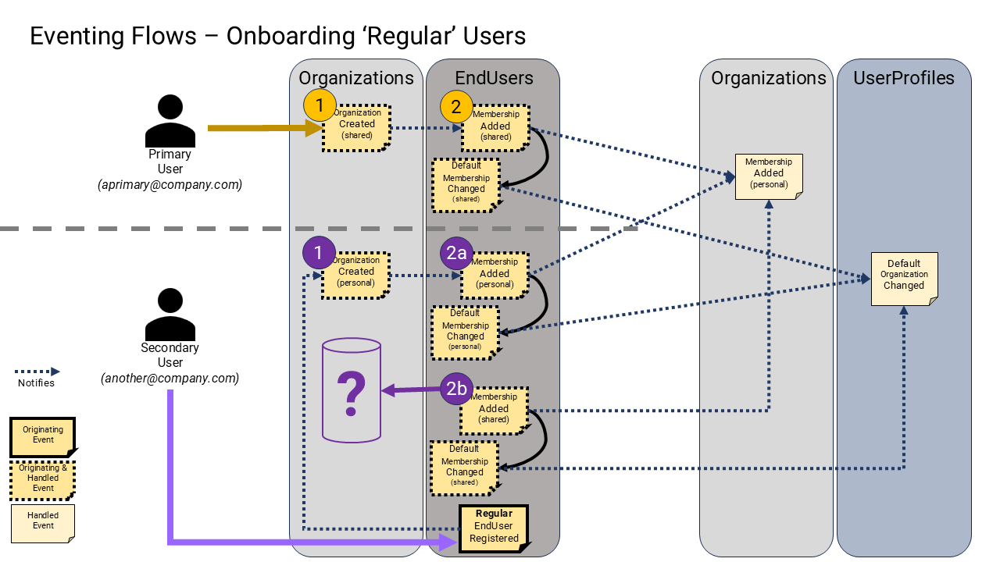

# User Onboarding

## Design Principles

* We want to provide a simple and consistent onboarding experience for all users of the platform, regardless of how they registered (i.e., via credential registration or, SSO authentication, etc.), and whether they discover the platform themselves or were invited by another user.
* Furthermore, since multi-tenancy is a pillar of this platform, we want to provide an easy and consistent onboarding experience for all users of all tenants, regardless of whether they are a member of a single tenant (i.e. an employee) or participate across multiple tenants (i.e. a contractor).
* We want user accounts to be unique in the universe (by email address), and we want individual user accounts to participate across any and all tenancies. If individual humans wish to have multiple user accounts, they are free to do so, but they must use different email addresses for each account.
* We want to support both B2C and B2B scenarios out of the box.
* We want to have some sensible defaults appropriate to many SaaS products, and also make simple things easy, like: multitenancy, as well as making complex policies and behaviors possible by extending all the default mechanisms.

## Implementation

We want to support the following behaviors and policies:

### Personal Organizations

1. All users will have a notion of a "default" organization at all times. Their "default" can be changed to any another organization that they are already a member of.
2. All newly registered users will be assigned to a 'personal' organization of their very own, with the same name as the user. This organization will have several characteristics including:
   * It will be the only organization the user is a member of, and their default, initially, when registered (if there are no other pending invitations to other organizations).
   * The user will be the 'billing owner' and administrator of their 'personal' organization.
   * This organization will be on a "free" billing plan by default (never a paid plan). As such it will be limited in features and capabilities. One of those features should remain self-serve upgrading to a paid plan.
   * The 'personal' organization cannot be deleted, and the owner/user can never be removed/transferred from it.
   * The user can be removed from all other organizations at any time, but they will always have and belong to their 'personal' org.
   * No other users can be invited into (or be a member of anyone else's) 'personal' organization.

### Shared Organizations

1. Any user can create any number of new 'shared' organizations, at any time, and they will be the initial "buyer" and 'billing owner' and administrator of that organization.
   * These 'shared' organizations can then be used to invite other users into.

### Invitations

At any time, an invitation to a specific organization can be made by any member of the platform to any email address in the universe.

If the inviter is a member of an organization and they are an "Owner" then the invitation will include an invitation to their specific organization.

A "guest" is defined as an ephemeral user that is not yet registered on the platform (we might only have their email address, from an invitation). They will have an `EndUser` record, but it will represent a placeholder for a future registered account.

When that user registers with the platform, no matter what the mechanism (i.e. invitation, or self-serve), they will come fully registered, and will automatically be joined to their invited organizations after their account is fully registered and onboarded.

Any authorized user can invite any email address to the whole platform, or to a specific organization on the platform.
* An email is sent to the invitee with a link to register. If they already have a registered account, they are just granted membership instantly.
* They may choose to click the invitation link, and register with the platform, or they may choose to register with the platform on their own.
* They may choose to ignore the invitation, and register with the platform directly themselves at a later date.
* Either way the result will be the same. If they have a pending invitation to any organization when the register, they will become members of that organization immediately after they register (regardless of how they register), and this organization will become their default organization.

### Account Merging

SSO authenticated users are essentially auto-registered to the platform, when they are authenticated by the SSO provider the first time.
* If they already have a user account, and this account has been previously registered with credentials (or other method) \[conceptually\], the accounts are merged together as the same account. Now they can authenticate with either method.
* Whether they authenticate with SSO first or second, or last, no matter what order, the result is the same.

### Automatic Onboarding

In B2B scenarios, it is common to want to automatically onboard users that work at the same company into the same organization, whether you explicitly invite them or not.
* Determining whether two users work at the same company can vary, but by default, sharing the same email domain is a good starting point.
* For this to work in real B2B scenarios, we must:
  * Forbid the use of non-company email addresses for users that create 'shared' organizations. For example, we cannot allow social email addresses, like: hotmail, gmail, etc. as their domain, does not accurately represent our customers actual companies email structures.
  * We must also enforce that only one organization can be created per email domain, in the universe.
* When a new "regular" user registers on the platform (regardless of how they register) if they share the same email domain as an existing 'shared' organization (created by a "primary" user before them), then they are automatically granted membership to that organization, and their default organization is set to that organization.

> Note: if a user has already registered before the 'shared' organization is created, then that user will NOT be granted automatic membership to that organization. However, they can still be invited into it explicitly later.

### Other Processes of Interest

#### Token Caching

At present we store a user's memberships in their authorization token (e.g., their *access_token*, a.k.a.  JWT).
This presents a challenge when their memberships or roles in an organization changes, as these tokens will not automatically update the data contained within them.

In order for the user to "see" a change in access to the platform as a result of a change of membership, or access to a specific membership, their *access_token* is required to be renewed. Which they can do by signing out and signing back in. Or, by refreshing their *access_token* after a maximum of about 15mins.

#### Authorization Roles

We explain the details of how authorization works in [Authentication and Authorization](0090-authentication-authorization.md) specifically with roles and features.

It is worth noting here that the roles of the user in any specific tenant/organization, or across the whole platform, are controlled by certain other roles. We have a concept of both platform roles, and tenant roles.

* **Platform roles/features** - apply to individual users, and the scope are all the shared services of the platform. In other words, any "untenanted" resources. Untenanted resources represent those resources that have no constraints around tenancy. They are shared across all tenancies. Resources such as `EndUsers` themselves, `Organizations`, `Subscriptions`, and `Images`, are all examples of "untenanted" resources.
* **Tenanted roles/features** - apply to all members of any specific tenant/organization. Each organization has its own set of these roles/features. 

By default any `tenant_owner`, can promote/demote other `tenant_owner` users in that specific organization. They can also assign other other predefined custom role to members of that tenancy.

>  These roles are customizable to every product

Therefore, we might have a specific `EndUser` who is an `tenant_owner` of `OrganizationA`, but who, at the same time, is just a `tenant_member` of `OrganizationB`, who also has their own 'personal' organization `OrganizationC`.

#### Billing Management

Billing Management is discussed in depth in [Billing Integration](0180-billing-integration.md), where you will find all the default billing behaviors defined in detail.

It is enough to say here that, we have a concept of a "Buyer" of a billing subscription that actually has the formal responsibility to be charged on a recurring basis for the service provided by the product. They literally need to have a valid "payment method" on file at all times (i.e. credit card). The buyer status is not a role (like "Billing Admin" is a role). Instead, "Buyer" it is a property of the `Subscription` associated to every `Organization`.

Every organization has one and only one billing buyer at all times. Every organization has one or more "Billing Admins" at any one time.

The "Buyer" is assigned to every organization upon creation, whether the organization is 'shared' or 'personal'.

> We recommend assigning 'personal' organizations to a "free" billing plan, by default - so that they can always sign in and upgrade to a paid plan at some point.
>
> We recommend assigning 'shared' organizations to a "trial" billing plan by default - so that they can try the service before they buy, and if not bought, their org (and all users are then relegated to the "free" plan).
>
> We assume a self-serve model.

 "Billing Admins" can be promoted and demoted by organization "Owners" or other "Billing Admins".
