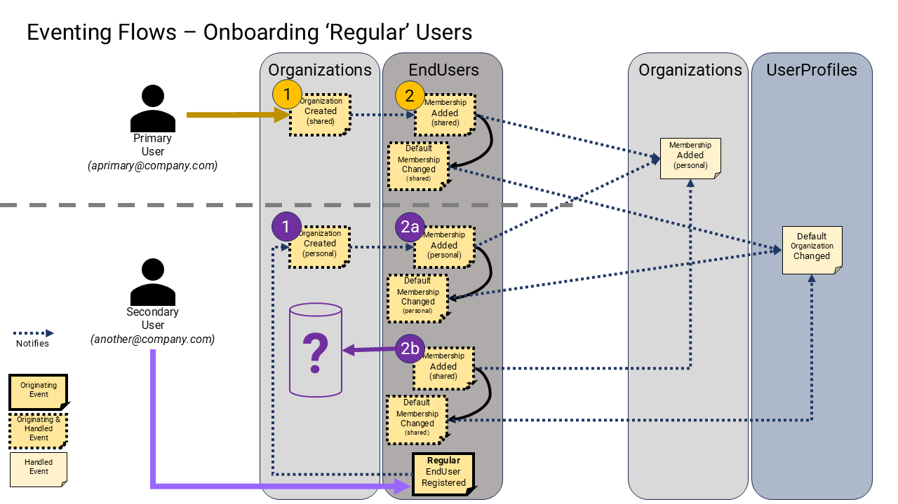

# User Onboarding

## Design Principles

* We want to provide a simple and consistent onboarding experience for all users of the platform, regardless of how they registered (i.e., via credential registration or, SSO authentication, etc.), and whether they discover the platform themselves or were invited in by another user.
* Furthermore, since multi-tenancy is a pillar of this platform, we want to provide an easy and consistent onboarding experience for all users of all tenants, regardless of whether they are a member of a single tenant (i.e. a business owner, or an employee) or participate across multiple tenants (i.e. a contractor, freelancer, etc.).
* We know user accounts are unique in the universe (by email address), and we want individual user accounts to participate across any, and all, tenancies.
  * If an individual (human) wishes to have multiple user accounts, they are free to do so, but they must use different email addresses for each account.

* We want to support anticipated and common B2C and B2B scenarios out of the box.
* We want to have some sensible defaults appropriate to many SaaS products, and also make simple things easy, like: multitenancy, as well as making complex policies and behaviors possible by extending all the default mechanisms.
  * Of course, all products re expected to adapt these defaults to their specific needs, which could not be completely generalized for all products (in the world)
* We want the onboarding of new customers to not only be a good experience for your new customers, and help them get to the "ah-ha" moment quickly, we also want it to be the first opportunity to demonstrate the scope of the product, and to be a measurable and insightful experience for your company, so that you can improve it. Onboarding is probably the most important opportunity you have to drive new adoption of your product, and the best place to focus on [time-to-value (TTV)](https://productled.com/blog/straight-line-onboarding).


## User Registration and Organization Membership

We want to support the following behaviors and policies:

### Personal Organizations

1. Recap: All users will have a notion of a "default" organization at all times.
   * Their "default" can be changed to any another organization that they are already a member of.
2. All newly registered users will be assigned to a 'personal' organization of their very own, with the same name as the user. This organization will have several characteristics including:
   * It will be the only organization the user is a member of, and their default, initially, when registered (if there are no other pending invitations to other organizations).
   * The user will be the 'billing owner' and administrator of their 'personal' organization.
   * This organization will be on a "free" billing plan by default (never a paid plan). As such it will be limited in features and capabilities. One of those features should remain self-serve upgrading to a paid plan.
   * The 'personal' organization cannot be deleted, and the owner/user can never be removed/transferred from it.
   * The user can be removed from all other organizations at any time, but they will always have and belong to their 'personal' org.
   * No other users can be invited into (or be a member of anyone else's) 'personal' organization.

### Shared Organizations

1. Recap: Any user can create (any number of) new 'shared' organizations, at any time, and they will be the initial "buyer" and 'billing owner' and administrator of that organization.
   * These 'shared' organizations can then be used to invite other users into.
   * For your B2B customers, this is how a tenant that represents their company is created, and is expected to be used by others at their company. We have special onboarding flows for those others at their company. 

### Invitations

Recap: At any time, an invitation to a specific organization can be created by any member of the platform, to any email address in the universe, (and or any known user by ID).

If the inviter is a member of an organization, AND they are an "Owner" of that organization, then the invitation will include an invitation to their specific default organization. Otherwise, the invitation does NOT include a membership to any organization.

>  A "guest" user is defined as an ephemeral user that is not yet registered on the platform. We might only have their email address, from an invitation at that time. They will have a persisted `EndUser` record, but it will represent a placeholder for a future registered account. During this time, we collect invitations to one or more organizations for them.

When that user eventually registers with the platform, no matter what the mechanism (i.e. invitation, or self-serve), they will come fully registered, and will automatically be joined to their invited organizations, after their account is fully registered and onboarded.

Any authorized user can invite any email address to the whole platform, or to a specific organization on the platform.

* An email is sent to the invitee with a link to register. If they already have a registered account, they are just granted membership instantly.
* They may choose to click the invitation link, and register with the platform, or they may choose to register with the platform on their own.
* They may choose to ignore the invitation, and register with the platform directly themselves at a later date.
* Either way the result will be the same. If they have a pending invitation to any organization when the register, they will become members of that organization immediately after they register (regardless of how they register), and this organization will become their default organization.

### Account Merging

SSO authenticated users are essentially auto-registered to the platform, when they are authenticated by the SSO provider, the first time the platform sees them.

* If they already have a user account, and this account has been previously registered with credentials (or other method) \[conceptually\], the accounts are merged together as the same account. Now they can authenticate with either method.
* Whether they authenticate with SSO first or second, or last, no matter what order, the outcome is the same – merged accounts.

### Automatic Colleague Onboarding

In B2B scenarios, it is common to want to automatically onboard users (that work at the same company) into the same existing organization, whether you explicitly invite them or not. i.e. pre-invited.

* Determining whether two users work at the same company can vary, but by default, sharing the same email domain is a good starting point.
* For this to work in real B2B scenarios, we must:
  * Exclude this behavior for non-company email addresses, when those (personal email users) create 'shared' organizations. 
    * For example, we cannot allow social email addresses, like: @hotmail.com, @gmail.com, etc. as their domain, does not accurately represent our customers actual companies email structures. Those are not companies, they are perhaps unrelated communities.
  * We must also enforce that only one organization can be created per email domain – in the universe.
* When a new "secondary" user registers on the platform (regardless of how they register), if they share the same email domain as an existing 'shared' organization (created by a "primary" user before them), then they are automatically granted membership to that organization, and their default organization is set to that organization immediately.
  * From their perspective, they are onboarded into their company organization automatically.




> Note: if a "secondary" user has already registered before the 'shared' organization is created, then that user will NOT be granted automatic membership to that organization. However, they can still be invited into it that organization, explicitly, later by any organization owner.

### Other Processes of Note for Onboarding

#### Token Caching

At present, we store a user's memberships in their authorization token (e.g., their *access_token*, a.k.a.  JWT).

This presents a challenge when their memberships or roles in an organization changes, as these tokens will not automatically update the data contained within them.

In order for the user to "see" a change in access to the platform (as a result of a change of membership) or access to a specific membership, their *access_token* is required to be renewed.

* Which they must do by SIGNING OUT and SIGNING BACK IN.
* Or, by automating the refreshing their *access_token* after a maximum of about 15mins.
  * As is done automatically (by the Web App) whenever their *access_token* expires, to prolong their session for beyond 15mins, and up to 14 days. 


#### Authorization Roles

We explain the details of how authorization works in [Authentication and Authorization](0090-authentication-authorization.md) specifically with roles and features.

It is worth noting here that the roles of the user in any specific tenant/organization, or across the whole platform, are controlled by certain other roles. We have a concept of both platform roles, and tenant roles.

* **Platform roles/features** - apply to individual users, and the scope are all the shared services of the platform. In other words, any "untenanted" resources. Untenanted resources represent those resources that have no constraints around tenancy. They are shared across all tenancies. Resources such as `EndUsers` themselves, `Organizations`, `Subscriptions`, and `Images`, are all examples of "untenanted" resources.
* **Tenanted roles/features** - apply to all members of any specific tenant/organization. Each organization has its own set of these roles/features. 

By default, any `tnt_own`, can promote/demote other `tnt_own` users in that specific organization. They can also assign  other predefined custom role to members of that tenancy.

>  These roles are customizable to every product

Therefore, we might have a specific `EndUser` who is an `tnt_own` of `OrganizationA`, but who, at the same time, is just a `tnt_mem` of `OrganizationB`, who also has their own 'personal' organization `OrganizationC`.

#### Billing Management

Billing Management is discussed in depth in [Billing Integration](0180-billing-integration.md), where you will find all the default billing behaviors defined in detail.

It is enough to say here that, we have a concept of a "Buyer" of a billing subscription that actually has the formal responsibility to be charged on a recurring basis for the service provided by the product. A buyer literally need to have a valid "payment method" on file at all times (i.e. credit card). The buyer status is not a role (like "Billing Admin" is a role). Instead, "Buyer" it is a property of the `Subscription` associated to every `Organization`.

Every organization has one and only one billing buyer at all times. Every organization has one or more "Billing Admins" at any one time.

The "Buyer" is assigned to every organization upon creation, whether the organization is 'shared' or 'personal'.

> We recommend assigning 'personal' organizations to a "free" billing plan, by default - so that they can always sign in and upgrade to a paid plan at some point.
>
> We recommend assigning 'shared' organizations to a "trial" billing plan by default - so that they can try the service before they buy, and if not bought, their org (and all users are then relegated to the "free" plan).
>
> We assume a self-serve model.

 "Billing Admins" can be promoted and demoted by organization "Owners" or other "Billing Admins".

#### Workflows

The overall process of onboarding a customer can take many diverse forms, for the end user.

Common forms might be:

* A single, wizard based onboarding experience from front to back – which is basically a monolithic workflow that a user has to complete – usually in one sitting.
* Some kind of "checklist" of tasks that need to be completed (in order to complete the total onboarding). Multiple steps, either in order, or in any order of steps. Assumes the user can move in and out of the workflow, in bite sized steps, at their leisure. They may never get all steps completed
* A hybrid of the two themes above. Where some steps are optional, some are mandatory. Where dismissing the whole experience or steps in the experience is supported.

## Implementation Details

The platform provides a flexible onboarding "engine" that runs/executes/manages a fully customizable workflow, designed to onboarding users or organizations, defined specifically by the UI client.

> Essentially, we are onboarding Organizations, not onboarding users. 

Out of the box, this onboarding engine is assumed to be pertinent to each tenant, and either applies to that tenant or a future tenant that could/should be created by that user.

> Onboarding individual user accounts, is not yet supported, and thought to be unnecessary/unwanted for multi-tenanted products.

Technically, the onboarding "engine" (and the customized workflow running inside the engine) is expected to (loosely) conform to a bi-directional [Directed Acyclic Graph (DAG)](https://www.geeksforgeeks.org/dsa/introduction-to-directed-acyclic-graph/) of steps. Which is a useful mathematical model for modeling workflows, that models nodes and vertices. However, this engine extends the formal unidirectional DAG definition, to allow certain human interactions, that soften the rules of strict unidirectional DAGs. For example, supporting bi-directional navigation, to allow humans to make mistakes and change their minds mid-process.  

### Key Concepts

* **Custom workflow schema** – defined by a client (of the API). One instance per organization. Contains the static definition of all workflow steps, weights, identifiers, and placeholder for custom values for each step, and defines the ordering and branching of steps in the workflow.
* **Onboarding engine** – the code in the Organization subdomain that operates/manages/maintains the state of a custom workflow schema, defined by the client.
* **Onboarding Handlers** – this is code (living somewhere in a subdomain, or in a client) that responds to the user enacting the custom workflow, and performs the automation of configuring a tenant as a result of a user executing the onboarding process.

#### Custom Workflow Schema

A custom onboarding workflow is composed of:

- **WorkflowSchema**: Defines the complete workflow structure with a name, collection of steps, start step ID, and end step ID
- **StepSchema**: Defines individual steps in the workflow with:
  - **Type**: `Start`, `Normal`, `Branch`, or `End` – determines the behavior of the current step and next step
  - **Title**: Display name for the step – used by the client
  - **Description**: Optional detailed description of the step (may be used by the client as a title)
  - **Weight**: Progress weight (integer, commonly 1-100) representing the relative importance/completion percentage
  - **NextStepId**: The ID of the next step from this step (not used for Branch or End steps)
  - **Branches**: Conditional branches for `Type==Branch` steps, that define an alternative path for the workflow to follow.
  - **Values**: Arbitrary key-value pairs for step-specific data, containing initial data values. Could be used to have defaults before the user answers any questions, that may or may not drive answers or branch decisions.

##### Branching Logic

Steps that are `Type==Branch` support optional conditional routing based on field values:

- **BranchSchema**: Defines a branch with:
  - **Label**: Display name for the branch option
  - **NextStepId**: The step to navigate to if this branch is taken
  - **Condition**: Optional evaluation criteria, that operates on the `Step.Values` collection, that can be evaluated to determine which path through the branch to proceed, when navigating forward through the branch. If not specified, then when navigating forward through a branch, will need the next step specified.
- **Condition Operator**: `Equals`, `Contains`, `GreaterThan`, `LessThan`

### Onboarding Engine

The engine that drives the custom workflow and manages its running state, the navigation through it, and controlling its lifecycle. 

#### Onboarding State

The `CurrentStepState` is returned in all API responses for all onboarding APIs. It tracks the runtime state of the current step of an onboarding workflow. From this state, a client should be able to visualize the entire process at a low level of resolution, but with high resolution of the current step.

> Imagine a magnifying glass sliding along a string at know fixed positions.

The current State, provides notable information for specific reasons for the client:

- **Status**: (`NotStarted`, `InProgress`, or `Complete`) – helps the client determine overall state of the workflow, and setup the overall experience for the current user. 
- **CurrentStepId**: imply the identifier of the current step. 
- **PathTaken**: Journey of completed steps (historical trail that the user has progressed through, accounting for any branches)
- **PathAhead**: The calculated shortest path (estimate) from current step to end (based on cumulative weight)
- **TotalWeight**: In points, undefined units. Sum of all the individual step weights in the workflow (may or may not be 100 points)
- **CompletedWeight**: In points, undefined units. Sum of weights for all completed steps (in the `PathTaken`)
- **ProgressPercentage**: Calculated as (`CompletedWeight` / `TotalWeight`) × 100
- **CurrentStepValues**: Key-value pairs for the current step's data. Completely cusotmizable by the client.
- **StartedAt**: When the workflow was initiated
- **CompletedAt**: When the workflow was completed (if applicable)

#### Workflow Validation (DAG Constraints)

All workflows are validated to ensure they form a valid modified bi-directional Directed Acyclic Graph:

1. **Single Start Node**: Exactly one step of type Start
2. **Single End Node**: Exactly one step of type End
3. **No Cycles**: The workflow must be acyclic (no circular paths)
4. **Start Has No Incoming Edges**: Nothing can navigate to the start step
5. **End Has No Outgoing Edges**: The end step cannot navigate anywhere
6. **All Steps Reachable**: Every step must be reachable from the start step
7. **All Steps Can Reach End**: Every step (except end) must have a path to the end step
8. **Valid References**: All NextStepId and branch NextStepId references must point to defined steps
9. **End Step Weight**: The end step must have a weight of 0
10. **Linear Workflow Weight**: Workflows without branches must have a total weight of 100
11. **Branch Steps Cannot Have NextStepId**: Branch steps must exclusively use their branch definitions for navigation

#### Navigation

The workflow supports both forward and backward navigation:

##### Forward Navigation

- **Automatic**: For `Normal` and `Start` steps, automatically navigates to the `NextStepId` (defined by the current step)
- **Conditional**: For `Branch` steps, evaluates branch conditions against current step values to determine the next step, OR
- **Manual**: Callers can explicitly specify the next step (validated against valid outgoing edges)
- **Path Calculation**: Uses BFS (Breadth-First Search) with distance tracking to calculate the shortest path ahead based on cumulative weight

> With `Branch` steps, if no `NextStepId` is specified and no condition evaluates to `true` then the leftmost (first) branch is automatically selected as the next step.  

##### Backward Navigation

- **Moves to Previous Step**: Navigates back to the last step in `PathTaken`
- **Updates PathTaken**: Removes the last step from the journey
- **Adjusts Weight**: Subtracts the current step's weight from `CompletedWeight`
- **Recalculates PathAhead**: Computes new shortest path from the previous step

#### Workflow Domain Service

The `OnboardingWorkflowGraphService` provides DAG and BFS algorithms for figuring out various workflow operations:

- **ValidateWorkflow**: Ensures the workflow forms a valid DAG
- **CalculateShortestPath**: Uses BFS to find the shortest path between two steps (by cumulative weight)
- **CalculateShortestPathToEnd**: Uses BFS to find the shortest path between two steps (by cumulative weight)
- **FindWorkflow**: Retrieves the workflow schema for an organization

#### API Operations

The onboarding workflow exposes the following operations to clients:

1. **InitiateOnboarding**: Creates a new onboarding instance with a custom workflow schema
2. **GetOnboarding**: Retrieves the current onboarding state at any time. Returns 404 if onboarding has not yet been initiated.
3. **MoveForward**: Advances to the next step (automatic or manual)
4. **MoveBackward**: Returns to the previous step
5. **UpdateCurrentStep**: Updates the values for the current step
6. **CompleteOnboarding**: Marks the onboarding as complete (can be forced from any step)

### Authorization

By default, all onboarding operations require the caller to be authenticated and to be an **Owner** of the organization (`Roles.Tenant_Owner`).   

By default, all onboarding APIs assume that the user is not yet upgraded to a paid/trial subscription, as that might be a optional step in their onboarding process.

### Example Workflow

Deciding when to introduce the user to the onboarding process can vary greatly in products – as can the workflow and the steps they need to follow. As can the data harvested during the process. As well as the actions taken as a result of onboarding successfully. As well as, when those actions are taken (i.e. at the end, versus during the workflow).

There is no general solution for all products, and there is no default in the product out of the box – a custom workflow will need to be defined and implemented for your specific product.


Here's an example of a simple onboarding workflow with a single branch based on user input:

```
┌─────────────┐
│   Start     │ (weight: 30)
│  "Welcome"  │
└──────┬──────┘
       │
       ▼
┌─────────────┐
│   Normal    │ (weight: 20)
│ "Company    │
│   Info"     │
└──────┬──────┘
       │
       ▼
┌─────────────┐
│   Branch    │ (weight: 20)
│ "Company    │
│   Size?"    │
└──┬────────┬─┘
   │        │
   │        └──────────────┐
   │                       │
   ▼                       ▼
┌─────────────┐      ┌─────────────┐
│   Normal    │      │   Normal    │
│ "Small Biz  │      │ "Enterprise │
│   Setup"    │      │   Setup"    │
│ (weight:15) │      │ (weight:15) │
└──────┬──────┘      └──────┬──────┘
       │                    │
       └──────────┬─────────┘
                  │
                  ▼
            ┌─────────────┐
            │     End     │ (weight: 0)
            │  "Complete" │
            └─────────────┘
```

**Workflow Definition:**

```json
{
  "name": "Company Onboarding",
  "startStepId": "welcome",
  "endStepId": "complete",
  "steps": {
    "welcome": {
      "id": "welcome",
      "type": "Start",
      "title": "Welcome",
      "nextStepId": "company-info",
      "weight": 30
    },
    "company-info": {
      "id": "company-info",
      "type": "Normal",
      "title": "Company Information",
      "nextStepId": "company-size",
      "weight": 20
    },
    "company-size": {
      "id": "company-size",
      "type": "Branch",
      "title": "Company Size",
      "weight": 20,
      "branches": [
        {
          "id": "small",
          "label": "Small Business (1-50)",
          "nextStepId": "small-setup",
          "condition": {
            "field": "employeeCount",
            "type": "LessThan",
            "value": "50"
          }
        },
        {
          "id": "enterprise",
          "label": "Enterprise (50+)",
          "nextStepId": "enterprise-setup",
          "condition": {
            "field": "employeeCount",
            "type": "GreaterThan",
            "value": "50"
          }
        }
      ]
    },
    "small-setup": {
      "id": "small-setup",
      "type": "Normal",
      "title": "Small Business Setup",
      "nextStepId": "complete",
      "weight": 15
    },
    "enterprise-setup": {
      "id": "enterprise-setup",
      "type": "Normal",
      "title": "Enterprise Setup",
      "nextStepId": "complete",
      "weight": 15
    },
    "complete": {
      "id": "complete",
      "type": "End",
      "title": "Onboarding Complete",
      "weight": 0
    }
  }
}
```

**Navigation Example:**

1. User starts at "welcome" (`PathTaken: [], CompletedWeight: 0, Progress: 0%`)
2. Move forward to "company-info" (`PathTaken: [welcome], CompletedWeight: 30, Progress: 30%`)
3. Move forward to "company-size" (`PathTaken: [welcome, company-info], CompletedWeight: 50, Progress: 50%`)
4. User enters `employeeCount = 25`, system evaluates branches and routes to "small-setup"
5. Move forward to "small-setup" (`PathTaken: [welcome, company-info, company-size], CompletedWeight: 70, Progress: 70%`)
6. Move forward to "complete" (`PathTaken: [welcome, company-info, company-size, small-setup], CompletedWeight: 90, Progress: 90%`)
7. Complete onboarding (`Status: Complete, CompletedWeight: 90, Progress: 100%`)

#### Triggering the workflow

Depending on your product's specific needs, you can choose to trigger the onboarding experience for your users at any time. The most common time to trigger an onboarding is probably immediately after user registration, when the user is known, authenticated and is using the whole platform:

1. After they self-serve a "credentials registration" process – after they have completed their registration-> confirmation->login interaction.
2. After they self-serve a "SSO-registration" process - after they have completed their SSO process (with some 3rd party provider, i.e. Microsoft).
   1. In either case (credentials or SSO) registration, they will be an authenticated and registered user accessing the app, and they will automatically have a "personal" organization assigned to them, set as their default organization. You can then use that "personal" organization to complete their onboarding process

You can also perform what is known as "Pre-Boarding" prior to the user being registered.

In Pre-Boarding, you can ask users for extra information in the registration process itself, over and above the usual `FirstName`, `LastName`, `EmailAddress` that is the minimum to register a user. You can ask for other information about them or their company/workspace, or ask "framing" questions that help the user understand how the product might work, and give the user confidence that this product is a fit for them. (Always framing this stuff for their benefit, not your company's benefit) 

> Note: Pre-Boarding steps that demand personal or professional details can be a far larger barrier to adoption (e.g., phone numbers, credit card details, sensitive company information etc.). Design this requirement (of yours) very carefully, it may significantly negatively affect adoption rates of your product, and should be applied with extreme caution!
>
> Defer that collection of data to an official onboarding process, once the user is using the product, rather then as a gate to pass through. Demonstrating an easy self-serve registration process is valuable to a prospective user, and builds trust instantly. Also, being able to skip onboarding, and letting them use the product immediately, (perhaps to those who have used it before, or familiar with it) can also demonstrate trust that increases the time-to-value and increases the chances of adoption, in the first few uses of the product.    

#### Automating Onboarding Outcomes

Regardless, of whether you harvest onboarding data during Pre-Boarding or from an Onboarding process, at some point you are likely to want to use this data to help automate the configuration of their tenancy (or user's account) in a way that makes using the product easier from that point forward for them – this is very common activity in all SaaS products.

Options are:

1. After Pre-Boarding (user registration), set up users or organizations (or memberships, or other resources), prior to the onboarding process, so that they come into the product with certain things already configured – and can continue in onboarding.
   - For example, if pre-boarding resulted in creating a "shared" organization for the registered user, they are going to be experiencing the product for the first time, assigned to that new "shared" organization, instead of experiencing it with their "personal" organization.
   - Any processes designed here are custom solutions built on existing APIs, and extending existing domain_events. No help from the included onboarding API's and its domain_events – as onboarding cannot be executed at this time.
2. During Onboarding process (no pre-boarding) users will be experiencing the custom onboarding process using their "personal" organization. During that workflow, you can be automating the creation of resources (or provisioning infrastructure) as the proceed through each step of the process. 
   - Warning: be careful with this approach, as a user can navigate back and forth in the workflow, and you probably don't want to be creating/provisioning duplicate resources as they repeat steps. Idempotency is the key here, for resource creation.
3. End of Onboarding process. After completing the onboarding process, and having the user confirm "completing" the onboarding process, possibly with some summary of their choices. This is a good time to provision all resources.
   - If done synchronously you can keep them waiting (progress indicators) and then populating their tenancy with data ready to view and use in the app.
   - Or, performing these actions asynchronously, and notifying them (via the app toast or by email) and directing them to the new resources in the app.


#### Workflows

The overall process of onboarding a customer can take many diverse forms, for the end user.

Common forms might be:

* A single, wizard based onboarding experience from front to back – which is basically a monolithic workflow that a user has to complete – usually in one sitting.
* Some kind of "checklist" of tasks that need to be completed (in order to complete the total onboarding). Multiple steps, either in order, or in any order of steps. Assumes the user can move in and out of the workflow, in bite sized steps, at their leisure. They may never get all steps completed
* A hybrid of the two themes above. Where some steps are optional, some are mandatory. Where dismissing the whole experience or steps in the experience is supported.

### Triggering The Workflow

Depending on your product's specific needs, you can choose to trigger the onboarding experience for your users at any given time. 

The most common time to trigger an onboarding is probably immediately after user registration, when the user is known, authenticated, and is already using the platform:

1. After they self-serve a "credentials registration" process – after they have completed their registration
   * e.g., UI registration -> UI email confirmation -> UI login (authentication)
2. After they self-serve a "SSO-registration" process - after they have completed their SSO process (with some 3rd party provider, i.e. Microsoft).
   * e.g., UI provider-authentication -> (auto-registration) -> auto-authentication 

At this point the user will already have a "personal" organization created for them, and that personal organization will be the organization they are now accessing the product with. 

* By default (and can easily be changed), this "personal" organization will be on the "free" billing subscription, where the user will have very limited functionality in the product – except, and importantly, functionality to upgrade their subscription to a paid subscription.

One common B2B onboarding activity, for some users, is to get them to create a tenancy (a "shared" organization) for their company, and work colleagues. (in B2C scenarios, or for some users, this activity may come later).

*  Onboarding is a great time to get a company tenancy created   

#### Pre-Boarding

You can also perform what is known as "Pre-Boarding" prior to a user being registered.

In Pre-Boarding, you can ask users for extra information in the registration process itself, over and above the usual minimum data: `FirstName`, `LastName`, `EmailAddress` (addtionally, and optionally `CountryCode`, `Locale`, and `Timezone`) to register a user.

You can ask for other information about them or their company/workspace, or you can ask "framing"/marketing questions that help the user understand how the product might work, and give the user confidence that this product is a fit for them. (Always framing this stuff for their benefit, not your company's benefit) 

> Caution: Pre-Boarding steps that demand personal or professional information can represent a far larger barrier to adoption (e.g., phone numbers, credit card details, sensitive company information etc.).
>
> Design this requirement (of yours) very carefully, it may significantly negatively affect adoption rates of your product, and should be applied with extreme caution only!
>
> Instead, defer collection of that data to an official onboarding process, once the user is using the product, rather then as a gated process to pass through, before seeing the product.
>
> Demonstrating an easy self-serve registration process is valuable to a prospective user, and builds trust instantly. Also, being able to skip onboarding, and letting them use the product immediately, (perhaps to those who have used it before, or familiar with it) can also demonstrate trust that increases the time-to-value and increases the chances of adoption, in the first few uses of the product.    

### Automating Onboarding Outcomes

Regardless, of whether you harvest onboarding data during Pre-Boarding or from some prescribed Onboarding process, at some point you are likely to want to use this data to help automate the configuration of the user's tenancy/organization (or user's account) in a way that makes using the product easier from that point forward for them. 

Usually, that the outcome we are trying to achieve from this process in the first place, which is very common activity in all self-serve SaaS products.

#### When to do it:

1. After Pre-Boarding (during the user registration process), set up users or organizations (or memberships, or other resources), prior to the onboarding process, so that they come into the product with certain things already configured – and can continue a process in onboarding.
   - For example, if pre-boarding resulted in creating a "shared" organization for the registered user, they are going to be experiencing the product for the first time, assigned to that new "shared" organization, instead of experiencing it with their "personal" organization.
2. During Onboarding process (post pre-boarding) users will be experiencing the custom onboarding process using their "personal" organization. During that workflow, you can be automating the creation of resources (or provisioning infrastructure) as the proceed through each step of the process. 
3. End of Onboarding process. After completing the onboarding process, and having the user confirm "completing" the onboarding process, possibly with some summary of their choices. This is a good time to provision all resources.

#### How to do it:

You have two main choices when it comes to how to enact the automation from Pre-Boarding and/or Onboarding workflows.

* **Imperatively:** Traditionally, you can extend existing APIs and workflows and add new data to be captured during these processes, and simply extend "imperatively" what is automated in each of the subdomains already, extending their workflows.
  * This will be familiar and synchronous, but use caution, and understand these workflows as a whole first, as changing them can have unintended consequences, depending on what changes over and above the workflows that already exist. The existing tests can be a good indicator of the changes you make.
  * However, if you are changing any public APIs and/or any *domain_events*, and you are already in production, with customers, you will need to be mindful of the impacts of breaking changes to existing data in production. (see [Migrating Domain Events](../how-to-guides/910-migrate-domain-events.md))
  * However, these processes complete synchronously, and it is easy to inform the waiting user when onboarding is completed.
* **Implicitly**: Non-traditionally, you can use the "implicit" mechanism to react to *domain_events* produced by a Pre-boarding or  Onboarding process.
  * Here, you are crafting a new Notification Consumer (i.e., `IDomainEventNotificationConsumer`) built in some listening subdomain (possibly, also in the `Organizations` subdomain) to handle one or more of these user registration or onboarding domain_events.
  * In this way, you are not changing any API's or directly interrupting any existing workflows, you are simply adding behavior to the existing software.
  * This can also have advantages, should the process change over time too.
  * However, these flows are asynchronous and eventually consistent, and you have to decide how to inform the waiting user when these processes are complete, so they can continue their work. There are several strategies for managing this eventual consistency in UXs, for example: 
    * **Optimistic UI Updates**: Assume completion. If possible, immediately reflect the change in the UI (e.g., show a new post or updated balance) assuming success. Especially good if the data is already known (i.e. part of the data you are using to make the update)
    * **Progress Indicators**: Have the user wait for completion (even though its non-deterministic when that occurs), using loading spinners or progress bars during long-running operations to manage user expectations. Usually coupled with some polling mechanism and some time-probability formular.
    * **Real-Time Updates via Subscriptions**: Use **WebSockets** or **GraphQL subscriptions** to push updates to the client as soon as the read model is updated, reducing the inconsistency window. 
    * **Notifications**: Allow the user to continue using the app, and then notify them later (some regular frequency) when the process has completed, and get them to enact some kind of switch over or refresh of their state. Usually requires polling for completion. 

#### More Implementation Notes:

> Warning: be mindful (with both implicit and imperative approaches) that apply to an Onboarding process. If you follow any kind of onboarding workflow, steps are likely to be re-entrant. A user likely can navigate back and forth in the workflow and repeat steps, as they experience the workflow.
>
> You probably don't want to be creating/provisioning duplicate resources as they repeat steps.
>
> Idempotency may be the key for resource creation in these cases, or saving the identifiers of created resources, so that you avoid creating them multiple times.
